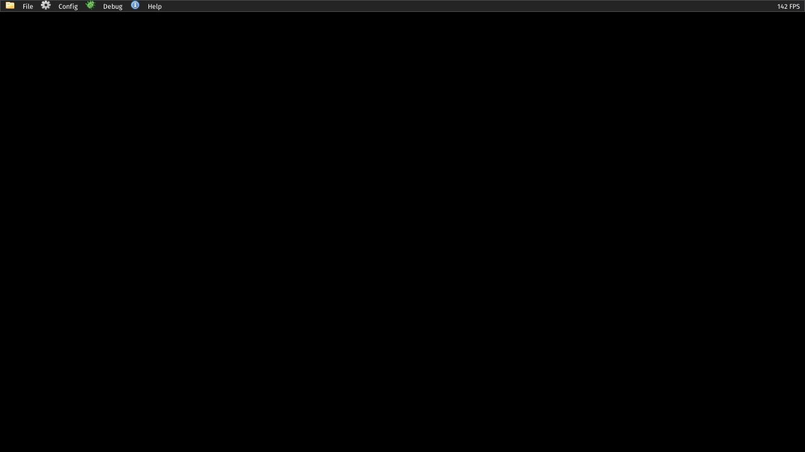
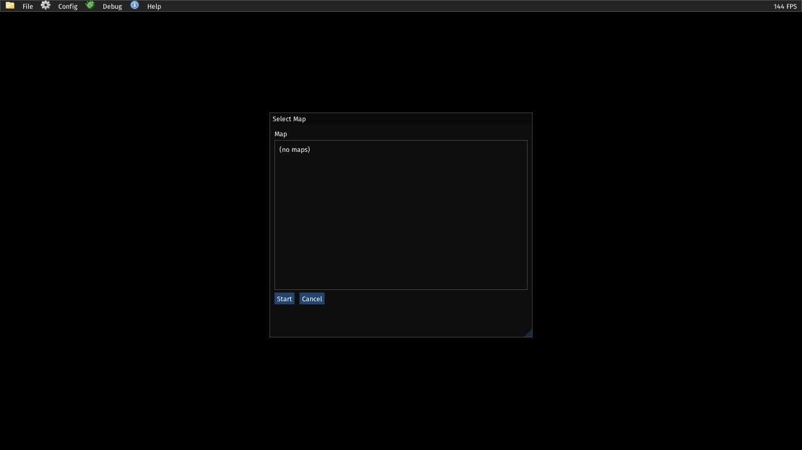

@page tut_first_base_package First base-game package

The only requirement for the engine to load a package is that it is a folder with a `package.meta` file. 

```
* my-base-package
    - package.meta
```

```scheme
(package
  (id "whatever.you.want") 
  (name "First Base Package")
  (version "0.3.0")
  (depends "whatever.you.want")) ; same as ID
```

A base-game package will not have other dependencies. From this point on you can run `slopengine --base-game path/to/game`. However, the menu will be black and the file menu empty. 



Because changing a map can be different in the context of different games package authors set this part up themselves. This tutorial will cover loading a map via a menu entry and loading via CLI argument and cover persistence/game flow in another. 

# Command line arguments

Packages can declare command line arguments by providing a definition for `*package-cli*`. Using the function `startup-arg` values can be fetched.

```scheme
; * data/cli.s7
; Defining the --map argument
(define *package-cli*
  '((flags
     ((name "map") 
      (value "string") 
      (help "Initial map folder under maps/")))))
```

There is an engine hook `on-startup` that package developers provide a callback for that can be used to prepare the package environment or execute certain events. As an example of loading a map with the `--map` argument

```scheme
; * scripts/init.s7
; on-startup reads argument and runs map if available
; otherwise show main screen
(define (on-startup)
  (let ((map-id (startup-arg "map")))
    (if map-id
        (request-map-load map-id "fresh")
        #t)))
```

Without the maps there is nothing to launch, but to test you can take any compiled map with a player start. Developers can also print out statements as a means of cheap debugging.

```scheme
; * scripts/init.s7
; on-startup reads argument and runs map if available
; otherwise show main screen
(define (on-startup)
  (let ((map-id (startup-arg "map")))
    (if map-id
        (display map-id)
        (display "No --map argument"))
    (newline)))
```

```
...
INFO: SHADER: [ID 6] Program shader loaded successfully
INFO: RENDER: entering menu (package on-startup / Debug → Map)
room
INFO: FILEIO: [/home/bryan/repos/engine/packages/engine/icons/silk.png] File loaded successfully
...
```

# Adding a menu option

As stated earlier the engine is unopinionated in regards to what the package wants to do with persistence. Some package authors might go for arcade-like games that don't require saving and loading or carrying some kind of game state over multiple maps. Another option is that package authors want something free of chapters, missions, episodes, or some kind of specific organization of flow. This means that saving, loading, and "new game" are controlled by the base package, including controlling when the player can or can't trigger these moments. 

> The intention is to eventually develop a proper UI API between s7 and Imgui and that the engine facilitates the window. 

The function `list-maps` is available to get a list of maps available after load. The engine will load any properly prepared arbitrary map. As to if a player can or can't is something the package author gates.

```scheme
; scripts/menus.s7
; Not proper scheme to use variables like this, but it will work
(define *menu-level-open* #f)
(define *menu-selected-map* "")

(define (open-level-select-menu)
  (set! *menu-selected-map* (or (current-map) ""))
  (set! *menu-level-open* #t))

; Engine callback to allow packages to define file menu contents
(define (draw-file-menu)
  (if (ui-menu-item "Select Map")
      (open-level-select-menu)
      #f)
  (ui-separator))

; Called from engine-hook `draw-modals`
(define (draw-level-select-modal)
  (if (not *menu-level-open*)
      #f
      (begin
        (ui-set-next-window-size 420 360)
        (ui-center-next-window)
        (if (not (ui-begin "Select Maps"))
            (ui-end)
            (begin
              (ui-text "Map")
              (ui-begin-child "maps" 240)
              (let ((maps (list-maps)))
                (if (null? maps)
                    (ui-text "(no maps)")
                    (for-each
                     (lambda (entry)
                       (let ((id (car entry))
                             (title (cdr entry)))
                         (if (ui-selectable title (string=? id *menu-selected-map*))
                             (set! *menu-selected-map* id)
                             #f)))
                     maps)))
              (ui-end-child)
              (if (and (ui-button "Start") (not (string=? *menu-selected-map* "")))
                  (begin
                    (request-map-load *menu-selected-map* "fresh")
                    (set! *menu-level-open* #f))
                  #f)
              (ui-same-line)
              (if (ui-button "Cancel")
                  (set! *menu-level-open* #f)
                  #f)
              (ui-end))))))

(define (draw-modals)
  (draw-level-select-modal))
```

