@page tut_first_map First map

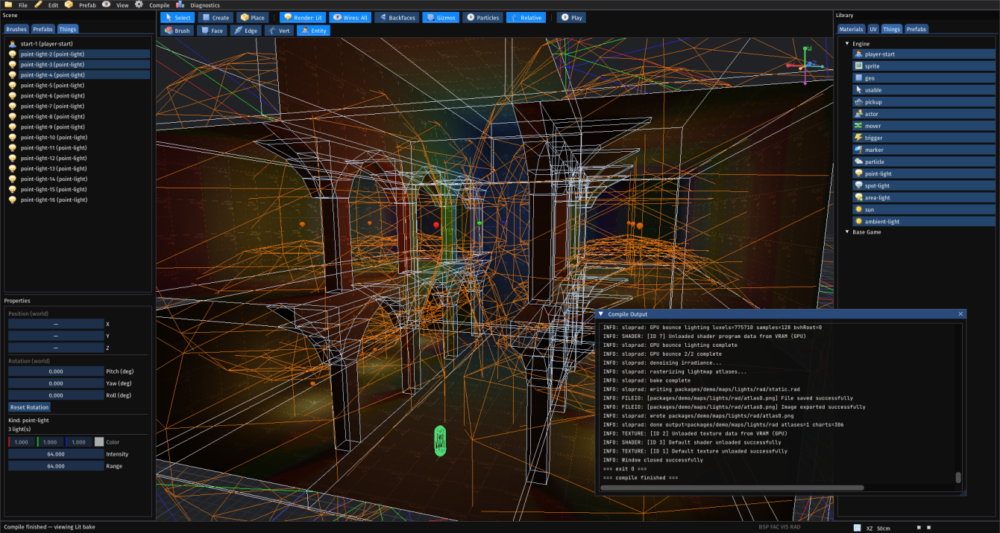

Touching on the tutorial "First base-game package" and having added the --map command line argument, it is now possible to launch a map from your base-game package.

# Maps {#maps}

Maps are folders that contain a number of files. There are 3 text-based s-expr based files that can be authored, in theory, with just a text editor.

1. `map.meta`: similar to `package.meta` that defines the name, authors, description, etc. 
2. `things.s7`: placeable logic containers. Actors, Lights, and basic components used in the map are defined in here
3. `static.csg`: Collection of concave and convex brushes and the type of brush

The other files are all compiled by tools provided with the engine. They are off-line command-line based tools with the intention of being able to use them in automation solutions or to integrate them via subprocesses in a given editor. 

# Opening the editor {#opening-the-editor}

`slopmap` is a CSG tool and map editor. It is a new product, but the implementation draws inspiration from a range of different 3D programs from Hammer, Trenchbroom, and Blender. Unlike Blender though this program doesn't work with mesh geometry but instead faces, edges, and solid shapes.

To start the program requires 2 arguments:

1. `--base-game` the package that is going to supply the base definition
2. `--target` which package should the changes made be saved to

If you want it to load an existing map or use content from other mods you can supply those as arguments as well.

```
> slopmap 
Usage: slopmap --base-game <path> [--mod <path>]... --target <path> [--map <name>]

  --base-game   Base game package directory (required)
  --mod         Additional mod package directory (repeatable)
  --target      Package directory that receives map/prefab saves (required)
  --map         Optional map under maps/ to open (default: new untitled map)
```

We'll leave the map argument out and create a new map for the new base-game package.

```
slopmap --base-game /path/to/my-base-package --target /path/to/my-base-package
```

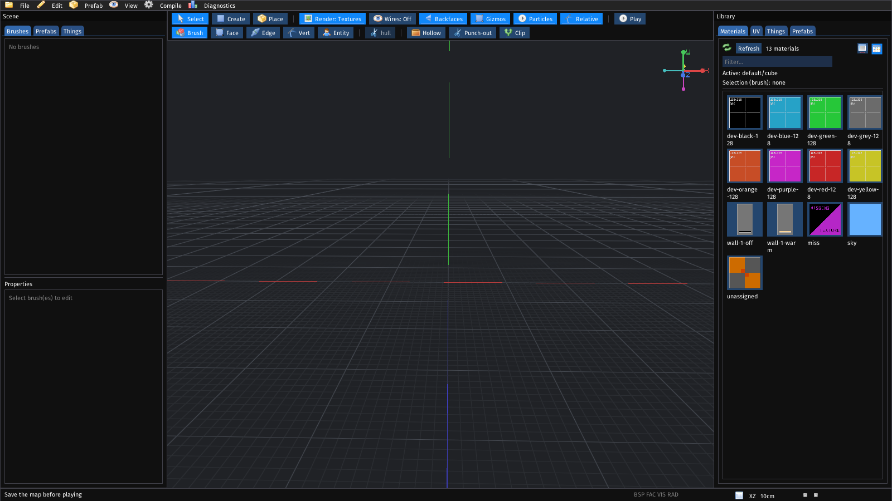

By default you will be looking at `(0, 0, 0)`. The first thing that we'll do is create an empty space to compile a map.

# User interface {#user-interface}

- Menu bar
    - File: New, load, save, quit
    - Edit: Selection options, operations
    - Prefab: Create CSG prefabs to re-use in maps
    - View: Camera options, snap options
    - Compile: BSP, FAC, VIS, RAD
    - Diagnostics: Something I put there once and forgot about

- Left panel
    - Tabs
        - Brushes: CSG brushes
        - Prefabs: Prefabs placed in the map
        - Things: Things placed in the map
    - Properties: Information shown on any selected object

- Right panel
    - Tabs
        - Materials: Materials that can be applied to brushes or faces of brushes
        - UV: Texture coordinate offset, rotation, scaling, and matching orientation with other faces
        - Things: Placeable game objects
        - Prefabs: Create objects and instance their placement in a map

# Controls {#controls}

- Navigate view: Hold right mouse, move mouse and use WASD
- Switch to top orthographic view: /
- Transformation tools: 
    - Lock axis with X, Y, Z keys
    - Translate: G
    - Rotate: R
- Select object with mouse, hold shift for multi-select. Contining to click will select objects behind other objects

Actions like creating a brush require confirmation using enter or mouse-click (inconsistent at the moment, neeeds to be fixed).

# Views {#views}

These are available in the views menu or via a button on the top of the canvas.

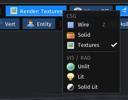

- CSG: This is a view of the CSG file to view what you have authored
    - Wire: Wireframe view
    - Solid: Solid view to see hull and non-hull brushes
    - Textures: See the unlit applied texture
- VIS/RAD: Requires compilation to see. If Geometry or lights changed needs to be recompiled to update
    - Unlit: Similar to CSG but shows the visible faces after culling
    - Lit: Light-baked scene
    - Solid Lit: No textures only light maps

# Wireframes {#wireframes}

Next to the CSG wireframe, wireframes can be viewed in other modes.

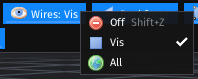

- Off: No wireframes are shown
- Vis: Only visible wireframe edges are shown
- All: All wireframes of all objects are shown

# Select options {#select-options}

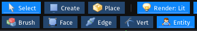

- Brush: Select CSG shapes
- Face: Select faces of CSG shapes
- Edge: Select the edge of a CSG shape
- Vert: Select the verticies of a CSG shape
- Entity: (_Should be thing. I never fixed it_) To place game objects

# Create options {#create-options}

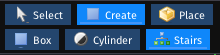

> Other than box these are incomplete and somewhat broken. Shape operations can be incredibly janky at the moment.

- Box: A CSG box
- Cylinder: A cylinder of N sides, extruded in the Y direction.
- Stairs: convience button for create simple stairs

To create a shape, place the cursor somewhere in the scene. Hit enter to start, drag the vertex out, and hit enter to confirm. Extrude the shape or type in the desired size, and hit enter.

# First Room {#first-room}

While large CSG maps will need to be heavily optimized to deal with compile times, to start out a 20m x 20m x 10m sized cube can be created and the hollowed out. 

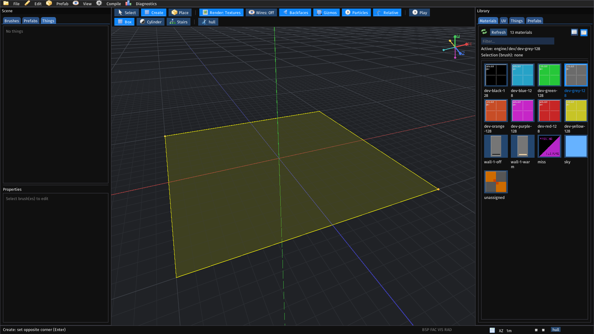

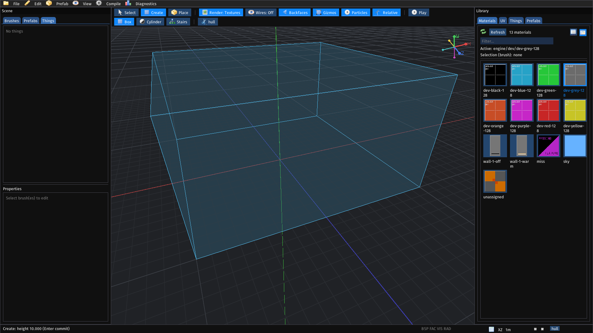

After pressing enter the cube will be created. If you selected a material it will use that material, otherwise just be white. You can assign a material to it by selecting it and then clicking another material.

After selecting a brush, the hollow operation can be chosen. A pop-up will be shown with options.

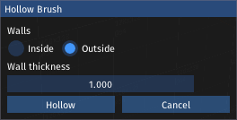

> I've only tested this using cubes. 

- Walls: Whether to place the walls on the inside or outside the current volume.  
- Wall thickness: Size in meters of how thick the new walls should be.

It doesn't matter which one you use, but for this example I will use outside.

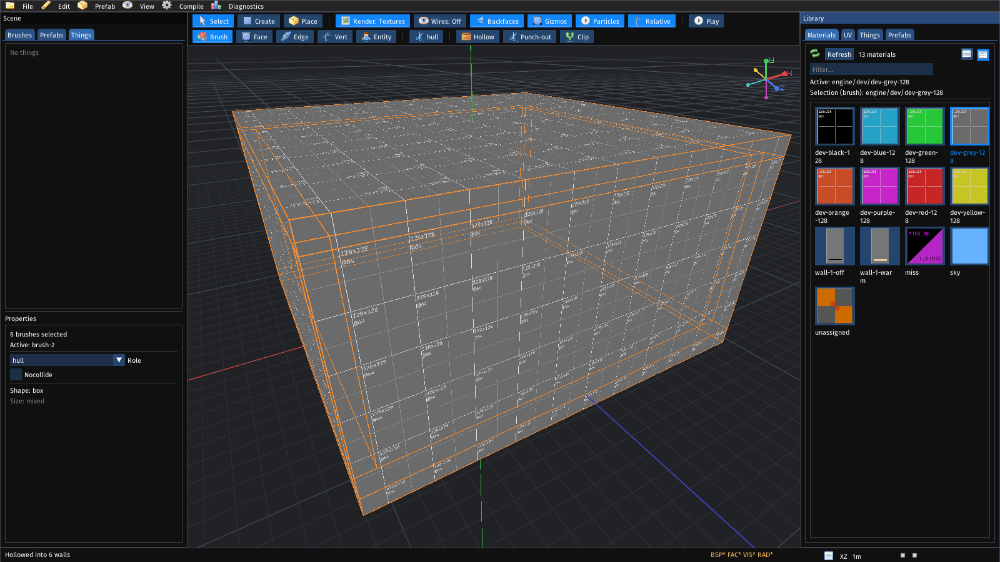

# Lighting {#lighting}

Maps at a minimum require only a BSP tree to run as the option is open to package developers to use their own shaders with material which can include some generalized lighting setup instead of using the baked lighting. For this though, without the light bake the map would look very flat. 

Lights can be placed in the map either via a light thing or by using emissive materials. Point, spot, and area behave like lights from other games. The sun light, combined with brushes using a sky material, will emulate sunlight coming in from a particular direction. The other method is using materials themselves as emissive surfaces so that the emissive part of the texture cast light into the scene, automating the work needed to manually place all lights by hand.

To make the room at least not pitch black, we can start by placing a point light in the middle of the room and increasing the radius and intensity under properties.

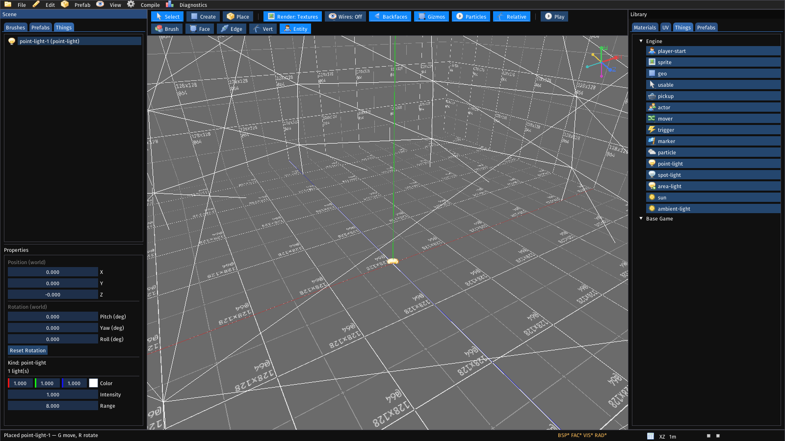

After placing the object you can press G and then Y to translate the light somewhere near the ceiling. Now this map can be baked.

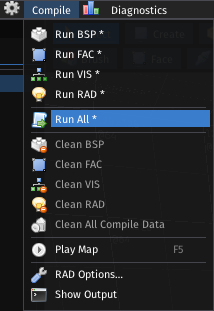

Each of these programs, BSP, FAC, VIS, and RAD are seperate command-line executables that can be run individually. The compiled data can also be cleaned from the editor. "Run All" simply calls all of them in order. After hitting "Run All" a console will appear to report messages from the compilers. Compilation also requires saving the map.

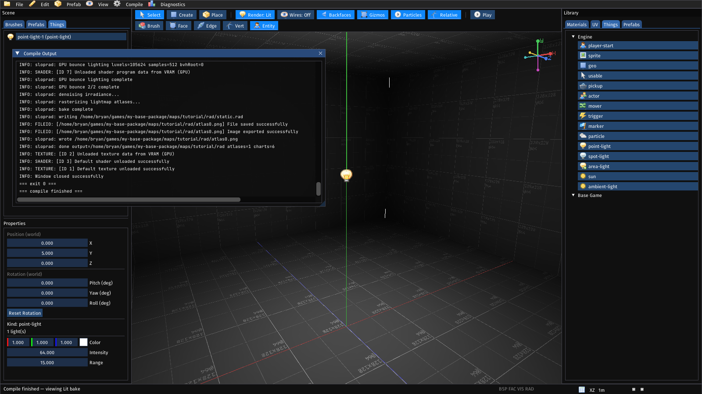

# Playing {#playtesting}

Every map requires a `player-start`. Just like the light, select the player start thing and place it somewhere in the map. Maps do not need to be recompiled for Thing changes, unless they are lights. Under compile and also on the toolbar a play button is available that launches the map.

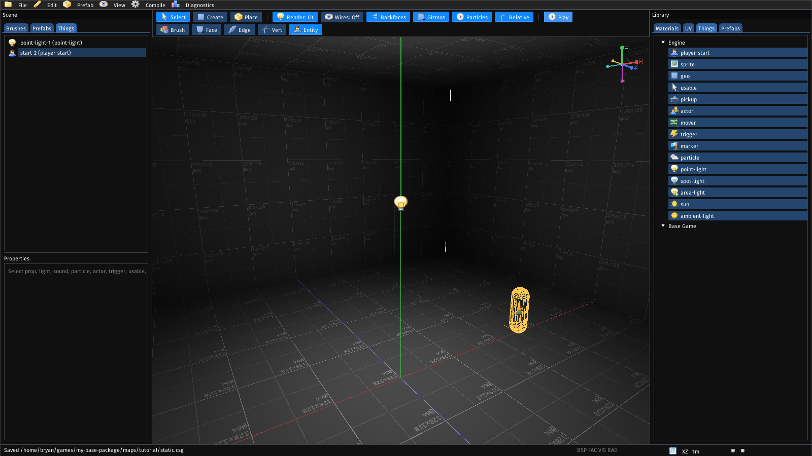

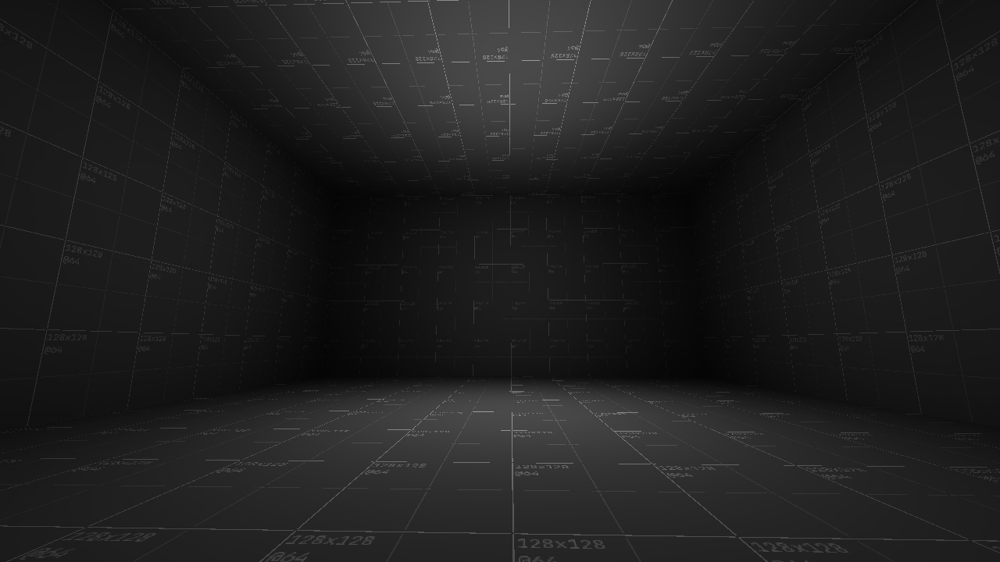