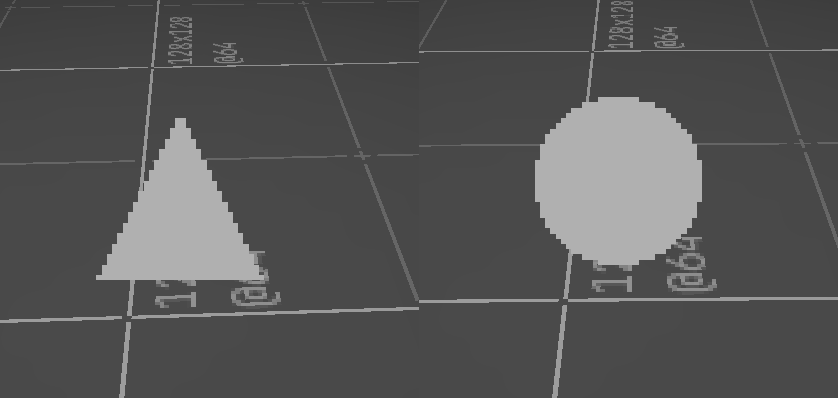

@page tut_first_sprites First sprites

Even though every 3D engine is capable of drawing billboards, having animated Doom style billboards that also keep their square pixel texels requires an implementation from assets to usable game sprites that translates that properly. This engine presents these Doom sprites as a kind of first class citizen so that package developers can author sprites and animations in a way similar to Doom.

# Doom & sprites {#doom-and-sprites}

Most Doom source ports, in an attempt to retain compatibility across all Doom WADs, have a fixed logic framerate of 35 ticks per second. Sprites were organized by a four character identifier (`TROO`), followed by a frame letter `A`, and then by a number for viewing angle. Sprites with 0 were always aligned to the screen, otherwise these numbers represented which angle sprite to show.

When developing "actors", authors would create an `Actor`, or with ZScript create a class that inherited `Actor`. There were a number of states this actor could have that the engine knew to look for, like `ready`, `death`, `see`, etc. Using the sprite identifier and frame, developers program out the animation. See this example from ZScript and UZDoom:

https://github.com/UZDoom/UZDoom/blob/trunk/wadsrc/static/zscript/actors/doom/doomimp.zs#L47

```zscript
	Spawn:
		TROO AB 10 A_Look;
		Loop;
	See:
		TROO AABBCCDD 3 A_Chase;
		Loop;
```

The number here is not the angle, but how many ticks the sprite should be shown. Every 10 engine ticks the TROO sprite switches between frame A and B. You can also see two functions being called here, `A_Look` and `A_Chase`, which one every 10 ticks looks to see if it sees a player, or if it has seen a player, every 3 frames while doubling up animation frames will move it in the direction of the player. Because developers knew how fast this was going to run, it was easy to include new functionality as well as be able to time things very easily, 10 ticks, 20 ticks, etc.

# Slopengine & sprites {#slopengine-and-sprites}

Since the old days, game engines have evolved where the presentation they are seeing is mostly being handled by a GPU while the game logic itself remains on the CPU. Of course it can't be helped that game logic has to result in a presentation change, but it's not really the case anymore to talk in terms of engine ticks, but in delta times. For animated sprites that represent enemies that launch attacks, that no longer have a discrete tick, this requires a different solution based on time. It also means that sprite appearance has to be separated from game functionality while still being able to keep them in sync without managing package-side timers to coordinate logic.

There are also other caveats to consider when designing your sprites. The engine makes no assumptions about sprites based on filenames. Individual sprites can have whatever you want. The rotations, mirroring, and other properties have to be setup in the sprite.

# Sprite file {#sprite-file}

Sprite files go in directory `sprites/` and have a `.spr` extension. Other files are ignored. These are symbolic files that define a sprite property. We'll look at one we made in our previous tutorial:

<pre><code class="language-scheme">(sprite
  (texel-size 64)
  (tint 1 0 0 1)
  (billboard screen)
  (frame "still"
    (rot 0 "engine/dev/sprite-square" offset 16 16)))
</code></pre>

* texel-size: Pixel density per 1m^2
* tint: optional parameter to "recolor" images
* billboard: how the sprite should look (screen, view, fixed)
* frame: list of frames that can be used for animation
  * rot: if sprite has rotations, 0 = none
  * the texture name of the sprite
  * X & Y texture offsets

# Sprite animations {#sprite-animations}

To create an animated sprite it's as easy as adding more frames. We'll create a new animated sprite that will animate between a square, circle, and triangle.

<pre><code class="language-scheme">(sprite
  (texel-size 64)
  (billboard screen)
  (frame "square"
    (rot 0 "engine/dev/sprite-square" offset 16 16))
  (frame "circle"
    (rot 0 "engine/dev/sprite-circle" offset 16 16))
  (frame "triangle"
    (rot 0 "engine/dev/sprite-triangle" offset 16 16)))
</code></pre>

Along with the `.spr`, a `.spanim` file of the same name describes animations that can be played:

<pre><code class="language-scheme">(sprite-anim
  (clip "loop"
    (loop 1)
    (frame "square" 0.125)
    (frame "triangle" 0.125)
    (frame "circle" 0.125)))
</code></pre>

To be able to place this on the map without triggering the animation from code, we can define a thing that is set to play this animation:

<pre><code class="language-scheme">(define (create-animated-prop id label sprite)
    (cons id
        (list (cons 'label label)
              (cons 'kind 'prop)
              (cons 'anim "loop")
              (cons 'frame "square")
              (cons 'sprite sprite))))

(define *package-things*
  (list
    (create-animated-prop 
        "animated-sprite" 
        "Animated Sprite" 
        "animated-sprite")
    ...))
</code></pre>

