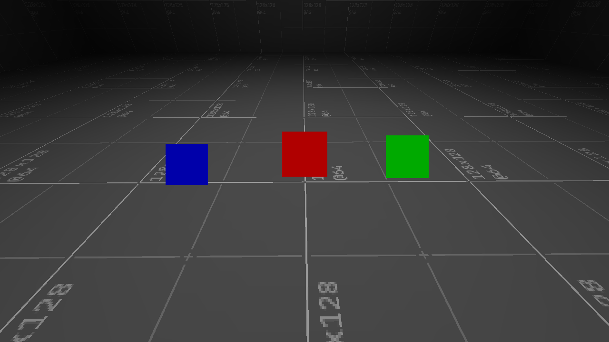
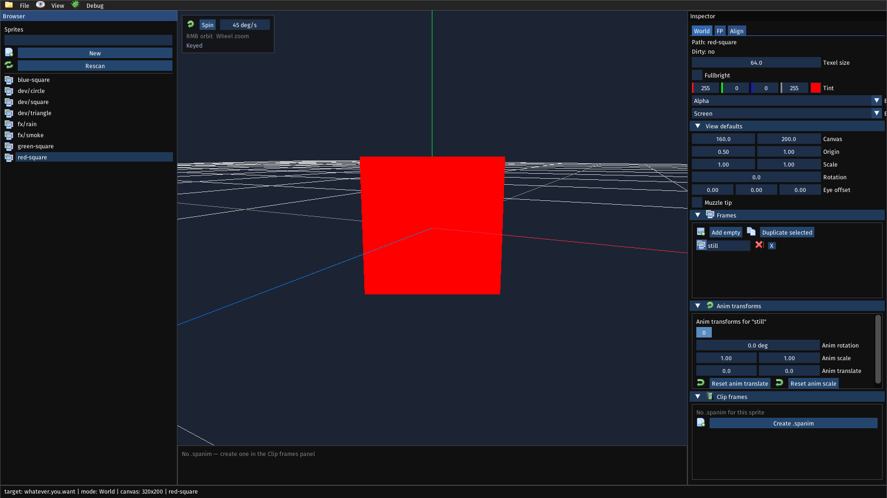

@page tut_first_things First things

It's nice that there is a lit map, but without interactive elements a game would be rather boring. Things as a term is taken from Doom as a way to place references to game objects on a map. Things here though are quite different that they are not strict actor definitions but are either basic or composable templates. 

The different base things that are provided by the engine are (and also under development):

- `player-start`: when the player is first placed in the map when it is loaded
- `sprite`: A billboard graphic defined in `sprites/`
- `geo`: Animated or static geometry defined in `geo/`
- `usable`: Allows a user to interact on use with the thing
- `pickup`: Allows a user to collide and trigger a pickup hook
- `prop`: Something used as decoration in a scene
- `actor`: A character with a motor and AI.
- `mover`: Used to control dynamic brush movement and how the brush reacts to other bodies
- `trigger`: A volume with an `enter` and `exit` hook
- `marker`: Used as point reference in map
- `particle`: Renders a particle animation
- Lights: Contributes to baked lighting
    - `point-light`: light emits from a single point outwards 
    - `spot-light`: light emits from a point inside a con
    - `area-light`: light emits from a surface
    - `sun-light`: emulates directional sunlight

In the first map tutorials developers placed a thing: the `player-start`. We wont cover the usage of all these in this tutorial, but give you an introduction to defining things as graphics and adding interactive things that use a callback. We will use engine provided assets, but you can use your own.

# Defining things

It would be rather annoying if every thing in the map was just a sprite that meant manually tweaking every single one to be something commonly placed on maps by map authors. It's not really realistic either than every single actor thing was composed on the spot. 

The engine defines white sprite textures `engine/dev/sprite-circle`, `engine/dev/square`, and `engine/dev/triangle`. In this tutorial we will defined colored versions of these. The first thing to do is to define new sprites with tints applied to them. You can create these sprite files that recolors the engine provided assets.

<pre><code class="language-scheme">; sprites/red-square-sprite.spr
(sprite
    (texel-size 64)
    (tint 1 0 0 1)
    (billboard screen)
    (frame "still"
        (rot 0 "engine/dev/sprite-square" offset 16 16)))
</code></pre>

<pre><code class="language-scheme">; sprites/green-square-sprite.spr
(sprite
    (texel-size 64)
    (tint 0 1 0 1)
    (billboard screen)
    (frame "still"
        (rot 0 "engine/dev/sprite-square" offset 16 16)))
</code></pre>

<pre><code class="language-scheme">; sprites/blue-square-sprite.spr
(sprite
    (texel-size 64)
    (tint 0 0 1 1)
    (billboard screen)
    (frame "still"
        (rot 0 "engine/dev/sprite-square" offset 16 16)))        
</code></pre>

# Placing things in maps

Afterwards in `data/things.s7` you can implement `*package-things*` to export thing templates for map authors to see. These will be visible in `slopsprite` as well as `slopmap`.

<pre><code class="language-scheme">; data/things.s7
; Write a function that is more readable
(define (create-sprite-prop id label sprite)
    (cons id
        (list (cons 'label label)        ; Plain-text label
              (cons 'kind 'prop)         ; Map decoration
              (cons 'frame "still")      ; Frame to show, all use 'still'
              (cons 'sprite sprite))))   ; Sprite name

(define *package-things*
  (list
    (create-sprite-prop "red-square"   "Red Square"   "red-square")
    (create-sprite-prop "green-square" "Green Square" "green-square")
    (create-sprite-prop "blue-square"  "Blue Square"  "blue-square")))
</code></pre>

We haven't covered this tool yet, but the new sprites will be shown correctly in `slopsprite`:

