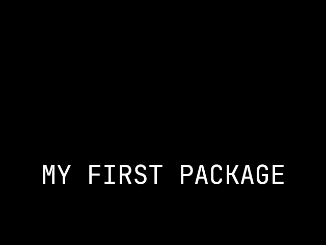
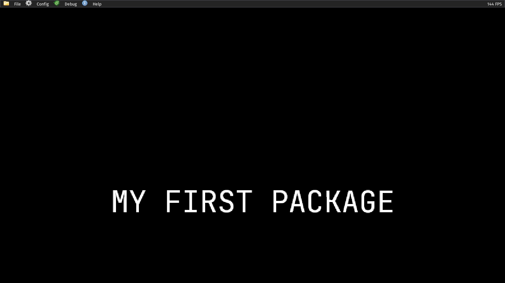
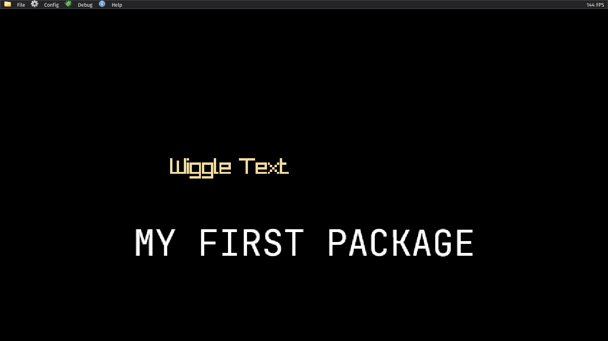

@page tut_first_title_screen First titlescreen

To help players know what game they've loaded and to help brand your game it is possible to set a menu background. There are 3 options available.

1. A simple background image similar to a desktop background
2. An immediate mode style API for drawing graphics and animations on a 2D canvas
3. A 3D mode which loads a map file and displays a scene using the player start as a camera position.

The 3rd mode is still a work in progress and won't be covered in this tutorial.



If you choose for option 1 then it's fairly straight forward. Save your image under textures and reference it in `data/title.s7`

```scheme
(define *package-title*
  '((image "titlepic" fit)
    (canvas 640 480)))
```



To have some animated elements though we will also use option 2 to draw some textures on the screen.

Developers implement the `draw-title` hook. They can combine this with the background image, or simply use this interface to draw the background. 

```scheme
; Keeping track of the phase
(define *title-phase* 0.0)
(define *title-label* "Wiggle Text")

(define (title-text-width str size)
  (* (string-length str) size 0.5))

(define (draw-title)
  (let* ((size 32)
         (w (title-text-width *title-label* size))
         (ox (* (sin *title-phase*) 100))
         (oy (* (sin (* *title-phase* 1.3)) 1.5))
         (x (+ (* -0.5 w) ox))
         (y (+ -22 oy)))
    (set! *title-phase* (+ *title-phase* 0.07))
    (hud-anchor 'center)
    (hud-text *title-label* (+ x 2) (+ y 2) size 0 0 0 160)
    (hud-text *title-label* (+ x 1) (+ y 1) size 0 0 0 200)
    (hud-text *title-label* x y size 240 220 160 255)))
```

This example code is available in the demo package. It can be run via:

```
./slopengine --base-game packages/demo
```

