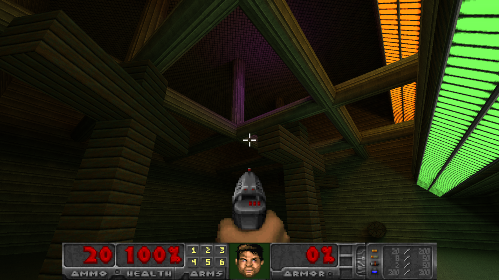

@mainpage Slopengine

slopengine is a C++/Scheme hobby project for making first-person games. It is aimed at non-commercial use: personal experiments, learning projects, and weekend games rather than studio pipelines or commercial shipping.

Despite the name, it is not a large self-contained engine. It is an assembly of popular free libraries, with a thin project layer that defines how content is stored, how first-person levels are built, and how tools like Blender feed into a running game. Most of what you would expect from an "engine" (a window, drawing, physics, gameplay structure, scripting) comes from those libraries. What this repository adds is the packaging, formats, and wiring that hold the assembly together.

<table width=100%>
    <tr>
        <td align="right"><b>Package-based content:</b></td>
        <td>Plain folders, text descriptors, and binary companions. Mods stack on a base package and override assets by path.</td>
    </tr>
    <tr>
        <td align="right"><b>S-expression and Scheme (s7):</b></td>
        <td>Materials, maps, scripts, and related descriptors. Readable on disk with any text editor.</td>
    </tr>
    <tr>
        <td align="right"><b>Focus on first-person games:</b></td>
        <td>character capsule, look, eye-space weapon / viewmodel sockets, and package-owned presentation hooks.</td>
    </tr>
    <tr>
        <td align="right"><b>CSG/BSP-based maps:</b></td>
        <td>Compile maps to BSP (binary space partition) inside an interactive map editor `slopmap`.</td>
    </tr>
    <tr>
        <td align="right"><b>Baked lighting:</b></td>
        <td>Offline baking on diffuse surfaces, plus small dynamic-light overlays for effects. No modern PBR stack.</td>
    </tr>
    <tr>
        <td align="right"><b>Albedo & emission materials:</b></td>
        <td>No normals, specular, or metallic here. Just textures with the option of having light emitting surfaces.</td>
    </tr>
    <tr>
        <td align="right"><b>Custom geometry format:</b></td>
        <td>Don't worry about exporting models in the correct orientation or the complexities of FBX or GLTF. Custom blender exporter available.</td>
    </tr>
    <tr>
        <td align="right"><b>Doom-style billboards:</b></td>
        <td>Multi-rotation frames, hit masks, and sprint animation clip banks that also support overlays and anchor points.</td>
    </tr>
    <tr>
        <td align="right"><b>3D Audio:</b></td>
        <td>Procedural sound effects possible via SoLoud as well as default 3D audio. Opt in build for using Steam Audio for environmental reverbs.</td>
    </tr>
    <tr>
        <td align="right"><b>ECS Architecture:</b></td>
        <td>Runtime entities and systems, with Scheme bindings for gameplay and UI hooks.</td>
    </tr>
    <tr>
        <td align="right"><b>Managed user data:</b></td>
        <td>Settings, screenshots, and save blobs keyed by persistence.</td>
    </tr>
</table>
&nbsp;

